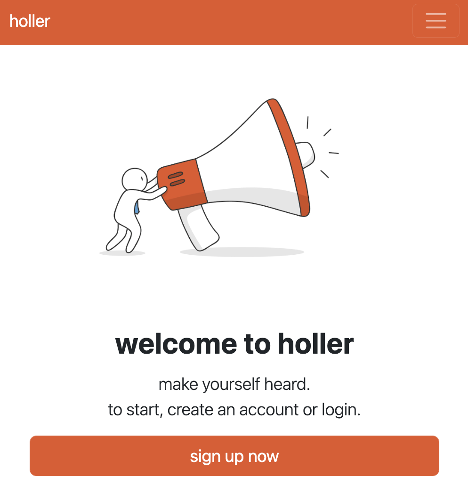
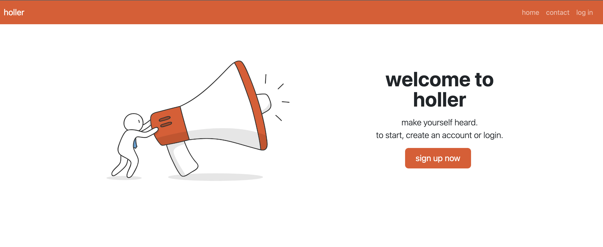
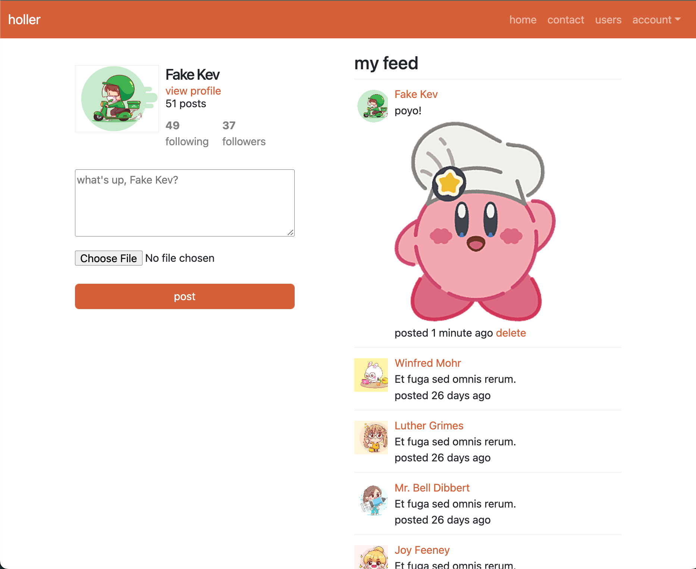

## Holler

Twitter clone made with Ruby on Rails and Bootstrap

 
 

<!-- 

 -->

### Starting the app

- First, install the necessary gems with `bundle`
- Next, setup the DB with `rails db:setup`
- You can now start the app with `rails server`

Icon images by mamewmy and dooder on Freepik
